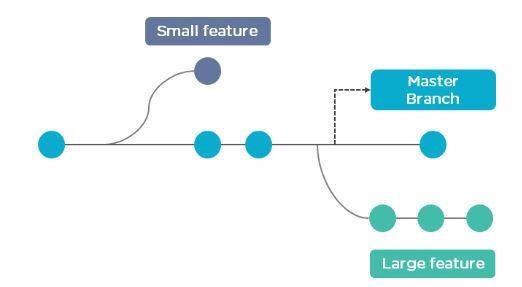

.. image:: _static/logo_full.png
    

Welcome to Gitlab-Sesyn documentation
=============================================

What is Git?
-----------------------
Git is a version control system used for tracking changes in computer files. It is generally used for source code management in software development.
- Git is used to tracking changes in the source code
- The distributed version control tool is used for source code management
- It allows multiple developers to work together
- It supports non-linear development through its thousands of parallel branches

GitLab is built on top of git to provide better adminstration and advanced tools. 

Features
---------
- Tracks history
- Free and open source
- Supports non-linear development
- Creates backups
- Scalable
- Supports collaboration
- Branching is easier
- Distributed development

Gitlab/Git Workflow
-----------------------------
.. image:: _static/git-workflow.jpeg
.. image:: _static/working-directory.jpeg
    
Gitlab/Git Branches
----------------------------
Branch in Git is used to keep your changes until they are ready. You can do your work on a branch while the main branch (master) remains stable. 
After you are done with your work, you can merge it with the main office.

Learn GitLab with tutorial
---------------------------------
https://docs.gitlab.com/ee/tutorials/

Groups
~~~~~~~~~~~~~~~~~~~~~~~~~~~
https://docs.gitlab.com/ee/user/group/index.html

Administer GitLab (only for Administer)
~~~~~~~~~~~~~~~~~~~~~~~~~~~~~~~~~~~~~~~~~~~~~
https://docs.gitlab.com/ee/administration/

User Guide
-----------

.. toctree::
   :maxdepth: 3
   :caption: Contents:

   Usage
   CheatSheet
      

Indices and tables
==================

* :ref:`genindex`
* :ref:`modindex`
* :ref:`search`
